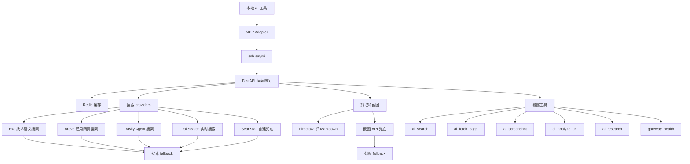

# Introduction

I recently set up a custom MCP on my server to aggregate search and screenshot upstreams, creating my own custom search gateway. Here, I'll describe the gateway's structure and workflow, which is a FastAPI project running on the server.

# Search Upstreams

## Exa

https://exa.ai/pricing, where you can see the free tier offers 1000 searches per month. After linking a card, you also get a $7 monthly trial credit, plus an additional $20 after completing registration tasks. The search quality is basically the best.

It's suitable for semantic search in areas like technology, academic papers, and open-source projects. The quality is high, but you need to be mindful of your quota.

## Brave

[Brave Search API | Brave](https://brave.com/search/api/). Requires linking a card, which gives you a $5 search credit. You can set a spending limit to ensure you don't get charged. Search quality is decent.

It's suitable for general searches like official websites, news, blogs, and regular web pages, providing stable results.

## Travily

[https://app.tavily.com/home](https://app.tavily.com/home). Offers a generous 1000 searches per month. Registering multiple accounts is also quite convenient, though abuse is not recommended. Search quality is pretty good.

It's suitable for agent-based searches, recent information, and web content completion, fitting well with AI workflows.

## Firecrawl

[https://firecrawl.org.cn/](https://firecrawl.org.cn/). Provides 1000 credits per month for scraping pages into Markdown.

Its main job is to extract the main content from web pages; it's not suitable as a general search source.

## Grok-search

GrokSearch Project Entry: [GuDaStudio/GrokSearch: Integrate Grok's powerful real-time search capabilities into Claude via the MCP protocol!](https://github.com/GuDaStudio/GrokSearch). I'm using it to integrate new Grok search capabilities.

Thanks to the public service sites within L-station, I've essentially achieved Grok freedom. Since search is what Grok is good for, I'm integrating it using the project from GitHub.

It's suitable for real-time news and querying new topics.

# SearXNG

[https://github.com/searxng/searxng](https://github.com/searxng/searxng), an open-source search engine project on GitHub. Its About section states: `SearXNG 是一个免费的互联网元搜索引擎，可汇总来自各种搜索服务和数据库的结果。用户既不会被跟踪，也不会被描述`

It's good for self-hosted fallback, as it doesn't rely on commercial APIs. However, quality can vary between different instances.
## Other Free or Low-Cost Upstreams

These can also be integrated:

- DuckDuckGo Instant Answer API: No key needed, suitable for lightweight entity queries
- GitHub Search API: Great for searching open-source projects. A GitHub account can generate a token for more quota.
- Stack Exchange API: For Stack Overflow Q&A, keys are requested on Stack Apps.
- Wikipedia and Wikidata: For encyclopedias and entities, no key needed.
- Hacker News Algolia: For technical community discussions.
- arXiv, OpenAlex, Crossref, PubMed, Semantic Scholar: For academic papers.
- Internet Archive: For historical pages.
- Common Crawl: For public indexes.

These are not included in the default search.
For specialized questions, use specialized sources.

My search fallback order is basically: auto-select source by question type first. Technical questions go to Exa, real-time questions to Tavily or Grok, general web pages to Brave. Then, the fallback order is brave -> tavily -> exa -> searxng.
# Screenshot Upstreams

[Free Developer Services: Screenshot APIs](https://github.com/xzulab/free-for-dev-zh#%E6%88%AA%E5%9B%BE-api). I basically registered for all of them listed there, so I'm pretty much covered. My AI's fallback order is essentially snapapi -> apiflash -> microlink -> screenshotlayer -> phantomjscloud -> screenshotbase -> screenshotscout -> screenshotmachine -> thumbnailws -> hqapi.

# Price Comparison Upstream

Tickerr Entry: [https://tickerr.ai/mcp-server](https://tickerr.ai/mcp-server). This can be used to get the latest prices for various AI services. However, I won't integrate it into my own gateway; I'll just connect to it when needed.

# My Workflow

First, I use a general model to analyze the request, then call search and screenshot APIs based on the requirements. Finally, I use the model to output the search and screenshot results in JSON format. Local Redis also caches some content, and the exposed tools are categorized for various application scenarios.

Mind Map

Exposed Tools

- `ai_search`: General search entry, defaults to 'auto' to let the gateway select upstreams by question type.
- `ai_fetch_page`: Scrapes the main content of a single web page, primarily relying on Firecrawl to convert it to Markdown.
- `ai_screenshot`: Actively takes a screenshot of a web page, suitable when the main content can't be scraped or when you need to see the page's state.
- `ai_analyze_url`: Scrapes a URL and then lets the model analyze it, suitable for reading documentation, announcements, or project pages.
- `ai_research`: Search, scrape, and summarize all-in-one, suitable for researching a topic.
- `gateway_health`: Checks if the remote gateway and various upstreams are currently configured correctly.

# Summary

This gateway essentially unifies search, scraping, screenshotting, and analysis into a single entry point.

All keys are stored on the server; local access is only via MCP calls.

General questions go through 'auto', specialized questions explicitly name the upstream, and failures trigger a fallback to another source.

This way, if one upstream goes down, it won't affect the entire AI search workflow.
