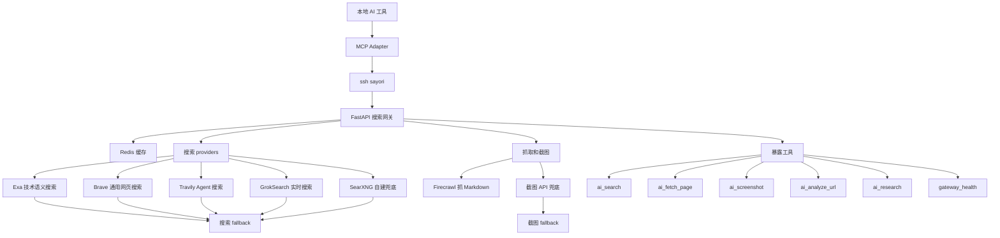

---
title: 创建你自己的搜索网关——我的搜索网关上游们
published: 2026-07-05
created: 2026-07-05
updated: 2026-07-05
lastEdited: 2026-07-05
updateCount: 0
description: ""
image: ""
tags:
  - 搜索
  - 自托管
category: 建站与自托管
draft: false
alias: ""
---

# 开头

站长最近在自己的服务器上面搭建了一个自己的自定义mcp用来聚合搜索上游和截图上游，实现自己的自定义搜索网关，在这里写一下网关的构成和工作流，是运行在服务器上的FastAPI项目

# 搜索上游

## Exa

[https://exa.ai/pricing](https://exa.ai/pricing)，可以在这里看到免费额度有每个月1000次，并且绑卡后还有每个月7美元的试用金，以及注册完成任务后还有二十美金的额度，搜索质量基本最好

它适合技术、论文、开源项目这种语义搜索，质量高，但是额度要省着用

## Brave

[Brave Search API | Brave](https://brave.com/search/api/)，需要绑卡，绑卡后会有五美元搜索额度，可以通过设置金额上限保证不会付费，搜索质量还行

它适合官网、新闻、博客、普通网页这种通用搜索，结果稳定

## Travily

[https://app.tavily.com/home](https://app.tavily.com/home)，每月1000次搜索额度，比较宽松，注册多账号也比较方便，当然不推荐滥用，搜索质量还不错

它适合 agent 搜索、近期信息和网页内容补全，和 AI 工作流比较搭

## Firecrawl

[https://firecrawl.org.cn/](https://firecrawl.org.cn/)，每个月都有1000次额度，用来抓取页面成Markdown

它主要负责把网页读成正文，不适合当普通搜索源

## Grok-search

GrokSearch 项目入口：[GuDaStudio/GrokSearch: Integrate Grok's powerful real-time search capabilities into Claude via the MCP protocol!](https://github.com/GuDaStudio/GrokSearch)，我拿它做新的 Grok 搜索接入

感谢L站内的公益站，基本实现了grok自由，而grok能用的也就是搜索了，所以就用github上面的项目缝合搜索进来

它适合实时消息和新东西查询

# SearXNG

[https://github.com/searxng/searxng](https://github.com/searxng/searxng)，Github上的一个开源项目，开源的搜索引擎，它的About是这样写的：`SearXNG 是一个免费的互联网元搜索引擎，可汇总来自各种搜索服务和数据库的结果。用户既不会被跟踪，也不会被描述`

它适合自建兜底，不依赖商业 API，不过不同实例质量会飘
## 其它免费或低成本上游

这些也可以接上

- DuckDuckGo Instant Answer API：不用 key，适合轻量实体查询
- GitHub Search API：搜开源项目很好用，有github账号可以生成一个token有更多的额度
- Stack Exchange API：搜 Stack Overflow 问答，key 在 Stack Apps 申请
- Wikipedia 和 Wikidata：查百科和实体，不用 key
- Hacker News Algolia：查技术社区讨论
- arXiv、OpenAlex、Crossref、PubMed、Semantic Scholar：查论文
- Internet Archive：查历史页面
- Common Crawl：查公开索引

这些不塞进默认搜索
专业问题再用专业来源

我的搜索fallback顺序基本就是auto 先按问题类型选源，技术类走 Exa，实时类走 Tavily 或 Grok，普通网页走 Brave，然后按 brave -> tavily -> exa -> searxng 兜底
# 截图上游

[免费开发者服务之截图API](https://github.com/xzulab/free-for-dev-zh#%E6%88%AA%E5%9B%BE-api)，站长就是把里面的全部注册了一遍就基本不缺了，然后站长听从AI的fallback顺序基本就是snapapi -> apiflash -> microlink -> screenshotlayer -> phantomjscloud -> screenshotbase -> screenshotscout -> screenshotmachine -> thumbnailws -> hqapi

# 比价上游

Tickerr 入口：[https://tickerr.ai/mcp-server](https://tickerr.ai/mcp-server)，这个可以用来获取目前的各种AI服务相关的最新价格，不过我不会接入到我自己的网关里面，这种需要的时候连一下就好了

# 我的工作流

先用普通模型分析需求，然后按照需求调用搜索和截图API，最后再用模型将搜索和截图的结果用json形式传出来，并且本地redis也会缓存部分内容，然后暴露的工具也区分了很多应用场景

思维导图

暴露的工具们

- `ai_search`：普通搜索入口，默认走 auto，让网关按问题类型选上游
- `ai_fetch_page`：抓单个网页正文，主要靠 Firecrawl 转成 Markdown
- `ai_screenshot`：主动截网页图，适合页面抓不到正文或者需要看页面状态时用
- `ai_analyze_url`：抓一个 URL 后让模型分析，适合读文档、公告、项目页
- `ai_research`：搜索、抓取、总结一条龙，适合查一个主题
- `gateway_health`：看远端网关和各个上游现在有没有配置好

# 总结

这个网关本质上就是把搜索、抓取、截图和分析统一成一个入口

密钥都放服务器，本地只通过 MCP 调用

普通问题走 auto，专业问题点名上游，失败就按 fallback 换源

这样一个上游挂了，不会影响整个 AI 搜索工作流
