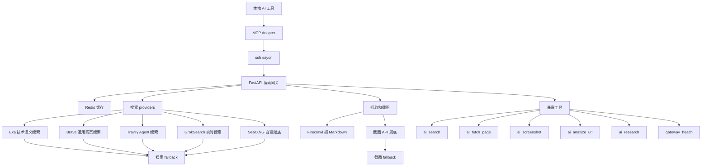

# 開頭

站長最近在自己的服務器上面搭建了一個自己的自定義mcp用來聚合搜索上游和截圖上游，實現自己的自定義搜索網關，在這裏寫一下網關的構成和工作流，是運行在服務器上的FastAPI項目

# 搜索上游

## Exa

[https://exa.ai/pricing](https://exa.ai/pricing)，可以在這裏看到免費額度有每個月1000次，並且綁卡後還有每個月7美元的試用金，以及註冊完成任務後還有二十美金的額度，搜索質量基本最好

它適合技術、論文、開源項目這種語義搜索，質量高，但是額度要省着用

## Brave

[Brave Search API | Brave](https://brave.com/search/api/)，需要綁卡，綁卡後會有五美元搜索額度，可以通過設置金額上限保證不會付費，搜索質量還行

它適合官網、新聞、博客、普通網頁這種通用搜索，結果穩定

## Travily

[https://app.tavily.com/home](https://app.tavily.com/home)，每月1000次搜索額度，比較寬鬆，註冊多賬號也比較方便，當然不推薦濫用，搜索質量還不錯

它適合 agent 搜索、近期信息和網頁內容補全，和 AI 工作流比較搭

## Firecrawl

[https://firecrawl.org.cn/](https://firecrawl.org.cn/)，每個月都有1000次額度，用來抓取頁面成Markdown

它主要負責把網頁讀成正文，不適合當普通搜索源

## Grok-search

GrokSearch 項目入口：[GuDaStudio/GrokSearch: Integrate Grok's powerful real-time search capabilities into Claude via the MCP protocol!](https://github.com/GuDaStudio/GrokSearch)，我拿它做新的 Grok 搜索接入

感謝L站內的公益站，基本實現了grok自由，而grok能用的也就是搜索了，所以就用github上面的項目縫合搜索進來

它適合實時消息和新東西查詢

# SearXNG

[https://github.com/searxng/searxng](https://github.com/searxng/searxng)，Github上的一個開源項目，開源的搜索引擎，它的About是這樣寫的：`SearXNG 是一个免费的互联网元搜索引擎，可汇总来自各种搜索服务和数据库的结果。用户既不会被跟踪，也不会被描述`

它適合自建兜底，不依賴商業 API，不過不同實例質量會飄
## 其它免費或低成本上游

這些也可以接上

- DuckDuckGo Instant Answer API：不用 key，適合輕量實體查詢
- GitHub Search API：搜開源項目很好用，有github賬號可以生成一個token有更多的額度
- Stack Exchange API：搜 Stack Overflow 問答，key 在 Stack Apps 申請
- Wikipedia 和 Wikidata：查百科和實體，不用 key
- Hacker News Algolia：查技術社區討論
- arXiv、OpenAlex、Crossref、PubMed、Semantic Scholar：查論文
- Internet Archive：查歷史頁面
- Common Crawl：查公開索引

這些不塞進默認搜索
專業問題再用專業來源

我的搜索fallback順序基本就是auto 先按問題類型選源，技術類走 Exa，實時類走 Tavily 或 Grok，普通網頁走 Brave，然後按 brave -> tavily -> exa -> searxng 兜底
# 截圖上游

[免費開發者服務之截圖API](https://github.com/xzulab/free-for-dev-zh#%E6%88%AA%E5%9B%BE-api)，站長就是把裏面的全部註冊了一遍就基本不缺了，然後站長聽從AI的fallback順序基本就是snapapi -> apiflash -> microlink -> screenshotlayer -> phantomjscloud -> screenshotbase -> screenshotscout -> screenshotmachine -> thumbnailws -> hqapi

# 比價上游

Tickerr 入口：[https://tickerr.ai/mcp-server](https://tickerr.ai/mcp-server)，這個可以用來獲取目前的各種AI服務相關的最新價格，不過我不會接入到我自己的網關裏面，這種需要的時候連一下就好了

# 我的工作流

先用普通模型分析需求，然後按照需求調用搜索和截圖API，最後再用模型將搜索和截圖的結果用json形式傳出來，並且本地redis也會緩存部分內容，然後暴露的工具也區分了很多應用場景

思維導圖

暴露的工具們

- `ai_search`：普通搜索入口，默認走 auto，讓網關按問題類型選上游
- `ai_fetch_page`：抓單個網頁正文，主要靠 Firecrawl 轉成 Markdown
- `ai_screenshot`：主動截網頁圖，適合頁面抓不到正文或者需要看頁面狀態時用
- `ai_analyze_url`：抓一個 URL 後讓模型分析，適合讀文檔、公告、項目頁
- `ai_research`：搜索、抓取、總結一條龍，適合查一個主題
- `gateway_health`：看遠端網關和各個上游現在有沒有配置好

# 總結

這個網關本質上就是把搜索、抓取、截圖和分析統一成一個入口

密鑰都放服務器，本地只通過 MCP 調用

普通問題走 auto，專業問題點名上游，失敗就按 fallback 換源

這樣一個上游掛了，不會影響整個 AI 搜索工作流
