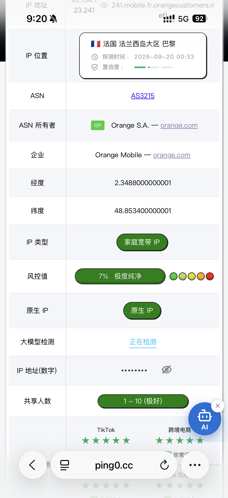

> [!WARNING]
> The publication date of this post is **2026-09-21**. The entries below combine user tests, referral links, and public pages seen around that date. They are not guaranteed to remain valid after publication. Registration eligibility, quotas, speeds, membership length, card requirements, renewal terms, and final checkout conditions must be checked on the official pages yourself.

Here are three recent leads. They change quickly, so treat them as leads rather than long-term promises.

## AnySearch: a search API

**Collected on: 2026-09-21**

- Website: [AnySearch](https://www.anysearch.com/)
- Skill documentation: [anysearch-skill](https://github.com/anysearch-ai/anysearch-skill/blob/main/)
- Type: search API

The user report I received says that a domestic student email can get 2,000 requests per day. The same user also tested an `edu.kg` address obtained elsewhere and said it passed the claim flow.

I am recording this as a **user test**, not as a confirmed long-term promise from AnySearch. Email eligibility, daily quotas, and API access may depend on the campaign batch, region, or account state. Do not use an educational address you do not genuinely own to bypass eligibility restrictions; follow the service terms and trust the dashboard's current result.

## Brain.fm: 365 days after linking a card?

**Collected on: 2026-09-21**

- Referral entry: [Brain.fm referral](https://brain.fm/refer?extended_promo=30&utm_source=referafriend)
- Use case: functional music and white-noise-like focus or relaxation audio

The user report says that opening this entry and linking a bank card can unlock **365 days of membership**. I could not independently confirm that duration as an official promise this time. Check the eligibility message, trial terms, renewal settings, and checkout page shown for your own account before linking a card.

Brain.fm may be useful as a sound environment for work, study, or relaxation. It is not a diagnosis or treatment for ADHD; if you only want to reduce background distraction, read the trial and renewal terms first.

This is a referral link and may attribute a reward to the referrer. If you do not want to use a referral relationship, start from the [Brain.fm website](https://www.brain.fm/) instead.

## USIMS: free eSIM with 1 GB high-speed data, then long-term low speed

**Collected on: 2026-09-20**

- Referral entry: [USIMS referral](https://referral.usims.com/ROBq/s1iqwqqr)
- User description: a free eSIM with 1 GB of high-speed data, followed by permanent 128 kbps access

The user report describes the offer with the terms above. USIMS's public App Store description currently mentions **Free Essentials Forever**: always-on low-speed data in more than 200 countries and regions, with no payment and no expiry, suitable for messaging, maps, calls, and basic travel apps. However, the public information I could verify did not independently confirm the exact “1 GB high speed,” “128 kbps,” or “residential IP” claims, so I am keeping those as user-test details.

The screenshot I received shows an IP check for Paris, France, Orange Mobile, a residential broadband IP, and a shared range of 1–10. That is one test result; it does not mean every eSIM, location, or time window will use the same network exit.

Before activation, check eSIM compatibility, destination coverage, the exact free-data speed and scope, and any extra conditions on the referral page. Official App Store listing: [USIMS](https://apps.apple.com/au/app/esim-built-for-travel-usims/id1555283998).

## Final reminder

- Post publication date: **2026-09-21**.
- Collection dates: **2026-09-21** for AnySearch and Brain.fm, and **2026-09-20** for USIMS.
- User reports/tests and independently verifiable official details are kept separate; unverified numbers are not guarantees.
- Any offer may expire, change its rules, or become account-specific after publication. Check referral attribution, auto-renewal, card requirements, and privacy terms before signing up.
