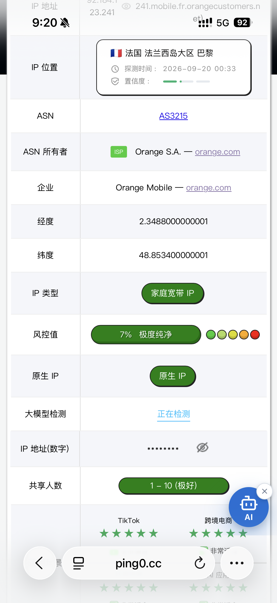

> [!WARNING]
> 本文發佈日期是 **2026-09-21**。這些內容來自當天的用戶實測、推薦鏈接和公開頁面整理，不保證在發佈日期之後仍然有效。註冊資格、額度、速度、會員時長、是否需要綁卡，以及結算頁顯示的最終條件，都要以你自己打開官方頁面後看到的內容爲準。

這篇先收三個最近看到的入口。它們的共同點是活動變化快，所以只適合當線索，不適合當作長期權益承諾。

## AnySearch：搜索 API

**整理日期：2026-09-21**

- 官網：[AnySearch](https://www.anysearch.com/)
- Skill 說明：[anysearch-skill](https://github.com/anysearch-ai/anysearch-skill/blob/main/)
- 類型：搜索 API

目前看到的用戶反饋是：國內學生郵箱每天可以使用 2000 次，用戶還實測過隨手領取的 `edu.kg` 郵箱也能通過領取流程。

這部分我只把它記作**用戶實測**，沒有寫成 AnySearch 的官方長期承諾。郵箱資格、每日額度和可用接口可能會隨活動批次、地區或賬號狀態變化。也不要使用自己並不實際擁有的教育郵箱去繞過資格限制，最終以服務條款和後臺顯示爲準。

## Brain.fm：綁卡領取 365 天會員？

**整理日期：2026-09-21**

- 推薦入口：[Brain.fm referral](https://brain.fm/refer?extended_promo=30&utm_source=referafriend)
- 用途：功能音樂、白噪音式的專注/放鬆環境聲

用戶提供的反饋是：通過這個入口並綁定銀行卡，可以獲得 **365 天會員**。我這次沒有把這個時長當作官方已確認事實；打開頁面後是否符合資格、是否需要先試用、是否會自動續費，都要以自己的註冊頁和結算頁爲準。

Brain.fm 可以作爲一些人工作、學習或放鬆時的聲音環境。它不能替代 ADHD 的診斷或治療；如果你只是想找一個減少環境干擾的工具，可以先看清試用和續費條件再決定是否綁定卡。

這是 referral 鏈接，可能會給推薦人帶來獎勵或歸因；不想使用推薦關係的話，可以從 [Brain.fm 官網](https://www.brain.fm/) 自己進入。

## USIMS：免費 eSIM，1GB 高速後低速長期使用

**整理日期：2026-09-20**

- 推薦入口：[USIMS referral](https://referral.usims.com/ROBq/s1iqwqqr)
- 用戶描述：免費家寬 eSIM，先送 1GB 高速流量，之後以 128kbps 永久使用

用戶反饋的賣點是上面這組流量條件。USIMS 在 App Store 的公開介紹裏可以看到 **Free Essentials Forever**：在 200 多個國家和地區提供不需要付款、不過期的低速數據，適合消息、地圖、通話和基礎出行應用；但這次公開資料沒有獨立確認“1GB 高速”“128kbps”以及“家寬 IP”這幾個具體說法，所以它們仍然按用戶實測記錄。

我收到的截圖裏，IP 檢測結果顯示爲法國巴黎、Orange Mobile、家庭寬帶 IP，並標註共享範圍爲 1–10。這個結果只代表這一次測試，不代表每張 eSIM、每個地區或每個時段都會得到相同的網絡出口。

激活前建議確認手機是否支持 eSIM、目的地是否有覆蓋、免費數據的具體速度和適用範圍，以及 referral 頁面是否要求額外條件。官方 App Store 入口：[USIMS](https://apps.apple.com/au/app/esim-built-for-travel-usims/id1555283998)。

## 最後再提醒一次

- 文章發佈日期：**2026-09-21**。
- AnySearch、Brain.fm、USIMS 的整理日期分別是 **2026-09-21、2026-09-21、2026-09-20**。
- “用戶反饋/實測”和“官方頁面能確認的內容”已經分開寫；沒有獨立確認的數字，不當作保證。
- 所有活動都可能在發佈日期後失效、改規則或改成僅限部分賬號。點擊 referral 鏈接前，也請留意推薦關係、自動續費、綁卡和隱私條款。
