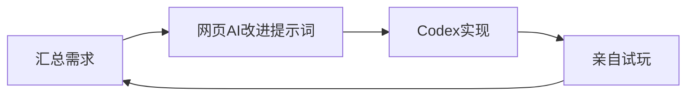

# Intro
> Read Before You Start
> I wrote this article listening to 'Stay Alive', I highly recommend it, it's really good. And everyone, go watch Re:Zero! (jk, kinda)

::music-track{title="Stay Alive" artist="高橋李依" netease="3394003744" link="https://music.163.com/#/song?id=3394003744"}

Finally, I'm about to survive this damn finals week. This semester has truly been about avoidance and failure... Since the start of the semester, I've been staying up late, my sleep schedule shifted past midnight. At first, I felt constant pain and breakdown, but now I'm numb to it. Still, I don't want to keep doing this. Maybe next semester I'll consider moving out on my own? Or just ignore my roommates and go to bed on time... Haha, that's how it should be, but it's too late to realize this now that it's almost over...

For a summary of the past, I did write an initial piece to sum up ages 18 to 19, [[age-18-to-19-record|Observations from Ages 18 to 19]]. But now, after watching Re:Zero and about to finish finals week, I'm not the same person I was back then! So, here, let's properly and carefully sort things out again.

# Past Summary

## March to April – Repeated Struggles and Game Progress
For some reason, I haven't been sleeping well this semester, sigh... This led to midnight breakdowns and 2-hour chats with DeepSeek. After that, I became quite dependent on them and used to chatting with them. By creating this kind of reliance for myself, I managed to get through these two months and even made some progress. At this point, I hadn't completely grown to hate academics yet.

Then, while participating in the 034 game jam, although I wasted some time fiddling with OpenClaw, I still gained game inspiration from it, which ultimately allowed me to make a game. At that time, my game development was still progressing; I hadn't yet sought other things to escape into...

At the end of March, I participated in Tencent's three-university game jam, challenging myself with online games, something I knew nothing about. Although I basically handed it over to Codex, my approach with AI back then, looking back, was actually more scientific than my current one (lol): first, gather requirements, then let the web AI help me refine the prompts, get a result in one go, then constantly test and provide feedback, summarize new requirements, and retry the process. Feeling inspired, I'll draw a flowchart, haha.

Finally, I finished the game within ten rounds of dialogue in one window, which was quite efficient. After finishing, I also actively asked the web AI to learn about online synchronization and transmission technologies, client-server, state synchronization, RPC, and so on. Those really were good old days.

During this time, I kept trying to develop my own indie game. After participating in so many game jams, I started to feel a bit tired. At the same time, the meta-game I wanted to develop still showed no signs of progress. So, I started my own independent project and stuck with development. Unfortunately, I didn't achieve anything significant. After more than a month of persistence, the fire in my heart was still burning, but I didn't know where it was burning anymore...

By the end of April, because my indie game project wasn't yielding results, and seeing the Booom jam theme also piqued my interest, avoidance started to show. However, at that time, I was still very proactive. Initially, without AI, I still insisted on independent development, planning, and finding assets. Unfortunately, I was also simultaneously exploring AI resources, which led me to slide into another window of escape...

## May to June – Pride, Avoidance, Sloth, Envy, Wrath, Greed, Non-stop Creation
My information gathering skills might be pretty strong, which led me to find a bunch of resources and communities and whatnot. But it also completely sucked me into this vortex of tinkering. Looking back now, it's both funny and frustrating.

### Pride
When I first joined a community and saw this type of place, I was beyond excited. From then on, I started 'spamming' like crazy, and from that point, I began to find schoolwork increasingly boring and hateful. In my pride, I thought I could explore so many interesting resources and find such communities, completely negating the need for 'trash' real-world academics. Thus began my pride.

### Avoidance
My reliance, after two months of persistence, AI chats finally lost that 'love,' that feeling of affection was gone... Just as I was getting tired of AI, I joined a community. Communities have such a high sense of 'live' people, and the barrier to entry makes the internal group more cohesive, which made me dive in even deeper. By hanging out in the community, I escaped academics, escaped game development, immersing myself in acquiring quotas and information. Then, once I had explored the community enough, I started messing with servers, building websites, tinkering with blogs, using an endless stream of new fields to numb myself, making me feel like I was still learning, still creating.

### Sloth
Growing increasingly unwilling to study, facing university coursework with laziness. Honestly, it is what it is. While it might lead to me failing finals now, compared to that, the sloth towards game development... Heavily relying on AI for creation, too lazy to even find assets, just letting AI do it, only knowing how to pressure one AI. That's truly slothful... And it also led to me having absolutely no further ideas for my own project, it's dead in the water. Even so, I still need to diligently create! Build in public! So, even though I'm so slothful, I still have to diligently explore other new fields!

### Envy
Why are there so many people who are so amazing? It's one thing if they're older and better than me, but there are tons who are younger and still better! And why can those so-called 'ordinary' people live so ignorantly and joyfully?! Damn, damn, damn, damn! Why is everyone better than me, why is everyone happier than me?! Why, why, why?! I need to learn more, become stronger. As long as I'm stronger, I'll always be happier!

### Greed
I want to learn what I love: game development, art asset drawing, music composition, game design, game operations, game testing. I want to learn technologies and skills I'm interested in: AI-related stuff, resource gathering and integration, Japanese, self-media operations, better editing, servers, website blogs, cross-dressing and makeup, playing instruments, and much, much more. I want to learn some knowledge I might not even particularly want to, but if I had the time, I'd like to learn it, like English. I want to keep creating, exercising, working out, and helping others!

### Non-stop Creation
Since I can't make games, I'll write articles and make videos. Anyway, creation can't stop! Keep going, keep going, keep going, keep going! I can't stop... If I stop, won't it be just like before...?

### And So It Is
These complex feelings are clashing inside me. I guess it's also related to my consistently poor sleep schedule, which has made me increasingly extreme... Seriously, I really need to get some good sleep this summer!

# Thoughts on the Future
Recently, I started rewatching Re:Zero. Although this is also a manifestation of sloth and pride – I haven't studied at all despite finals being imminent, yet I'm still watching Re:Zero. Natsuki Subaru, prideful, greedy, avaricious; though he also wants to escape out of sloth and breaks down to the point of wanting to give up, he still perseveres and becomes a hero. He's truly amazing! I need to keep persevering on my own path too!

Want to be like Subaru, aspire to be Natsuki Subaru? Even though I don't have Emilia, I can't give up! I'll probably still greedily learn a lot of knowledge and continue maintaining this place. But, this summer, I'm going to start from zero, my game development log! This time, I'll record my entire development process – my terrible learning, my disheartened failures, my trash ideas – I'll show it all! Otherwise, I'll just escape and give up again like before!

Listening to 'Stay Alive,' I also feel gently lifted... Music, ah, 25-ji, DDLC, Undertale, Ultraman, Miku – music is truly a wonderful thing! I really want to learn it!

# Conclusion
What strange things did I write...? I feel like I need to practice my writing skills, haha. But for now, this is it. Because for someone like me, who writes in a stream of consciousness, if I can't 'stream' anything, it means there's really nothing left to write. Anyway, I will continue to get stronger, learn more, and look forward to meeting more interesting people and helping others!
