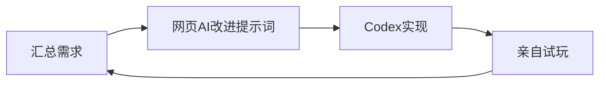

---
title: 再次启程，从零开始的游戏开发生活
published: 2026-07-02
created: 2026-07-02
updated: 2026-07-02
lastEdited: 2026-07-02
updateCount: 0
description: 即将熬过该死的期末周，对于过去的总结，未来的思考，汇聚成一篇文章
image: ""
tags:
  - gamedev
  - 独立游戏
  - 复盘
  - 成长回顾
category: 日常回声
draft: false
alias: re0game-dev-life
---
# 开头
> 阅前注意
> 这篇文章是听着《Stay Alive》写的，也推荐你听听这首歌，真的很好听，然后所有人都去给我追re0（雾）

::music-track{title="Stay Alive" artist="高橋李依" netease="3394003744" link="https://music.163.com/#/song?id=3394003744"}

终于要熬过该死的期末周了，这个学期还真是，逃避与失败啊......从开学就一直晚睡，作息被改成了0点后，一开始就一直感到痛苦和崩溃，现在已经麻木了，但是却还是不想这么做，也许下个学期我会想搬出去自己住？或者就是不顾忌这些室友了，自己到时间按时睡大觉......本该如此哈哈，但是现在都要结束了，才意识到这一点也太晚了......

过去的总结，之前为了总结18到19岁，倒是也初步写过一篇，[[age-18-to-19-record|十八到十九岁观察记录]]，不过现在看完re0和即将考完期末周的我，已经和当时不一样了！那就在这里，重新好好仔细的梳理一遍吧

# 过去的总结

## 3月到4月——反复抗争与游戏推进
这个学期也不知为何，从一开始就睡不好觉，唉...导致过凌晨时的崩溃和deepseek畅聊2h，然后接下来就变得十分依赖她们和习惯找她们聊天，通过这样一个给自己创造寄托的方式，我能够熬过这两个月，并且也取得了一定的进展，而此时的我，也还没有彻底厌恶学业

然后在参加034 gamejam的时候，虽然也因为折腾openclaw耽误了时间，不过却也从中收获了游戏的灵感，让我最后还是做出了游戏，这个时间的我，游戏开发还是在推进的，还没有寻求那些其他的东西逃避......

三月底的时候，参加了腾讯三校的gamejam，挑战自己一无所知的联机游戏，虽然基本就是交给codex，但是那个时候的我用AI的方式，仔细想想比现在的我还要科学（笑）：先汇集需求，然后再交给网页的AI陪我改进提示词，最后一口气出来，然后再不断的测试和反馈，总结出新的需求，重试上述流程，兴致来了，画一个流程图吧hh

最后在一个窗口十轮对话内就做完了游戏，还是很精炼的，同时做完后，也积极的询问网页AI学习联机相关的同步和传输技术，客户端和服务端，状态同步和rpc啥的，那时候还真是一段美好的日子

期间一直在尝试开发自己的独立游戏，在参加了这么多gamejam后，也是感到有些厌倦，同时自己想要开发的，meta游戏，仍然迟迟看不到影子，所以就去开了一个属于自己的独立项目，然后坚持开发，可惜我还是没有做出什么很大的成果，坚持了一个多月的我，虽然心中的火焰还在燃烧，但是已经不知道烧到哪里了...

四月底，因为自己想开发的独立游戏始终没有成果，再加上看到Booom jam的主题也挺感兴趣的，逃避初步显现，不过那个时候的我，还是很积极的，一开始在没有AI的情况下，仍然坚持自主开发和策划还有找素材，可惜我同时也在同步探索AI资源，导致我开始滑入另外一个逃避的窗口......

## 5月到6月——傲慢，逃避，怠惰，嫉妒，愤怒，强欲，创作不停
我的信息搜集能力或许还挺强的，导致我找到了一堆资源和社区啥的，却也让我彻底陷入这些折腾的漩涡，现在回去看，也是哭笑不得

### 傲慢
在加入了社区，第一次见识到这种社区类型的地方的时候，给孩子激动的不要不要的，从此开始了疯狂的水，并且从这时候开始，觉得学校的课业开始变得逐渐无趣，厌恶；傲慢的我觉得我能够探索到这么多有趣的资源和找到这种社区，完全不需要垃圾的现实课业，傲慢的开始

### 逃避
我的依靠，在我坚持了两个月后，AI聊天终于也丧失了那种爱，那种爱的感受感觉不到了...正好在我对于AI厌倦的时候加入了社区，社区这种活人感超高，而且有门槛导致内部更加团结，导致我更喜欢陷入进去了，通过在社区里混逃避课业，逃避游戏开发，沉浸于获取额度和信息，然后社区也逛的差不多了，就开始搞服务器，搭建网站，折腾博客，用不止的新领域来麻痹，让我感觉我还在学习，还在创作

### 怠惰
越发不想学习，懈怠的面对大学课业，说实话，这反而也就这样，虽然确实造成了我现在期末可能挂科吧，但是相比而言，对于游戏开发的懈怠啊......重度依赖AI创作，连素材都懒得找让AI找，只知道压力一个AI，还真是怠惰啊...然后也导致对于自己的项目完全没有接下来的想法，死档了，即便如此，也要勤勉的创作啊！build in public！所以如此怠惰的我还要继续勤勉的探索其他新的领域啊！

### 嫉妒
为什么会有这么多人都这么厉害啊，比我大还比我厉害就算了，比我小还比我厉害的更有一堆；而那些所谓的普通人，为什么可以这么无知而又享乐的活着啊！可恶可恶可恶可恶！为什么都比我厉害，为什么都比我幸福！为什么为什么为什么！我还要学会更多，变得更强，只要更强，总会更幸福的！

### 强欲
我要学我喜欢的，学习游戏制作，美术素材绘画，音乐创作，游戏策划，游戏运营，游戏测试；我要学我感兴趣的技术和技能，AI相关，资源搜集整合，日语，自媒体运营，更好的剪辑，服务器，网站博客，女装化妆，乐器弹奏，更多更多；我要学习一些或许我甚至不怎么想学的知识，可是如果有时间的话，我也想学会呢，比如学英语；我要继续坚持创作，运动，健身，帮助他人！

### 创作不停
既然游戏做不出来，那就写文章做视频吧，反正创作不能停下来啊！继续继续继续继续！我不能停下啊...要是停下了的话，不就和之前一样了吗...

### 就这样
这些复杂的感觉在我的身体里横冲直撞，感觉也和一直没有很好的作息有关吧，导致我变得愈发极端了......真的是，暑假你可得好好的睡啊！

# 未来的思考
最近重新开始看re0了，虽然这也是怠惰和傲慢的表现呢，明明临近期末考，自己一点都没学，可是却还是在看re0。菜月昴，傲慢，强欲，贪婪，虽然也会怠惰的想要逃避，也会崩溃到想要放弃，可是却还是坚持成为了英雄啊，还真是，厉害极了！我也要在我的道路上，继续坚持下去啊！

想成为昴一样的人，憧憬成为菜月昴？虽然我没有艾米莉亚，但是也不能放弃啊！我应该还是会强欲的学习很多知识，继续维护这里，不过啊，我要在暑假，开始从零开始，我的游戏开发记录！这次我要把我的开发过程都记录下来，我的不堪的学习，失意的落魄，垃圾的灵感，也要都展示出来！否则就又会像之前一样逃避放弃了！

听着《Stay Alive》，也感觉自己被温柔的托举了...音乐啊，25时，ddlc，undertale，ultraman，miku，音乐可真是一个好东西！好想学会啊！

# 总结
我写了什么奇怪的东西......我感觉我还要练一练我的写文章技术了哈哈，不过就先这样了，因为对于我这种意识流来说，如果意识不到东西了，那就说明真的没啥能写的了，总之，我会继续变强，学会更多，也期待能够结识更多有趣的人，帮助他人！
