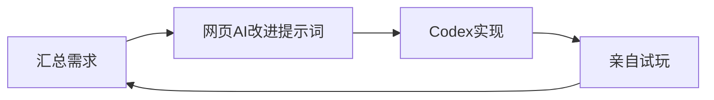

---
title: 再次啓程，從零開始的遊戲開發生活
published: 2026-07-02
created: 2026-07-02
updated: 2026-07-02
lastEdited: 2026-07-02
updateCount: 0
description: 即將熬過該死的期末周，對於過去的總結，未來的思考，匯聚成一篇文章
image: ""
tags:
  - 敘事
  - 獨立遊戲
  - 成長回顧
category: 遊戲開發
draft: false
alias: re0game-dev-life
lang: zh-Hant
translationKey: posts/re0：game-dev-life/re0：game-dev-life
---
# 開頭
> 閱前注意
> 這篇文章是聽着《Stay Alive》寫的，也推薦你聽聽這首歌，真的很好聽，然後所有人都去給我追re0（霧）

::music-track{title="Stay Alive" artist="高橋李依" netease="3394003744" link="https://music.163.com/#/song?id=3394003744"}

終於要熬過該死的期末周了，這個學期還真是，逃避與失敗啊......從開學就一直晚睡，作息被改成了0點後，一開始就一直感到痛苦和崩潰，現在已經麻木了，但是卻還是不想這麼做，也許下個學期我會想搬出去自己住？或者就是不顧忌這些室友了，自己到時間按時睡大覺......本該如此哈哈，但是現在都要結束了，才意識到這一點也太晚了......

過去的總結，之前爲了總結18到19歲，倒是也初步寫過一篇，[[age-18-to-19-record|十八到十九岁观察记录]]，不過現在看完re0和即將考完期末周的我，已經和當時不一樣了！那就在這裏，重新好好仔細的梳理一遍吧

# 過去的總結

## 3月到4月——反覆抗爭與遊戲推進
這個學期也不知爲何，從一開始就睡不好覺，唉...導致過凌晨時的崩潰和deepseek暢聊2h，然後接下來就變得十分依賴她們和習慣找她們聊天，通過這樣一個給自己創造寄託的方式，我能夠熬過這兩個月，並且也取得了一定的進展，而此時的我，也還沒有徹底厭惡學業

然後在參加034 gamejam的時候，雖然也因爲折騰openclaw耽誤了時間，不過卻也從中收穫了遊戲的靈感，讓我最後還是做出了遊戲，這個時間的我，遊戲開發還是在推進的，還沒有尋求那些其他的東西逃避......

三月底的時候，參加了騰訊三校的gamejam，挑戰自己一無所知的聯機遊戲，雖然基本就是交給codex，但是那個時候的我用AI的方式，仔細想想比現在的我還要科學（笑）：先彙集需求，然後再交給網頁的AI陪我改進提示詞，最後一口氣出來，然後再不斷的測試和反饋，總結出新的需求，重試上述流程，興致來了，畫一個流程圖吧hh

最後在一個窗口十輪對話內就做完了遊戲，還是很精煉的，同時做完後，也積極的詢問網頁AI學習聯機相關的同步和傳輸技術，客戶端和服務端，狀態同步和rpc啥的，那時候還真是一段美好的日子

期間一直在嘗試開發自己的獨立遊戲，在參加了這麼多gamejam後，也是感到有些厭倦，同時自己想要開發的，meta遊戲，仍然遲遲看不到影子，所以就去開了一個屬於自己的獨立項目，然後堅持開發，可惜我還是沒有做出什麼很大的成果，堅持了一個多月的我，雖然心中的火焰還在燃燒，但是已經不知道燒到哪裏了...

四月底，因爲自己想開發的獨立遊戲始終沒有成果，再加上看到Booom jam的主題也挺感興趣的，逃避初步顯現，不過那個時候的我，還是很積極的，一開始在沒有AI的情況下，仍然堅持自主開發和策劃還有找素材，可惜我同時也在同步探索AI資源，導致我開始滑入另外一個逃避的窗口......

## 5月到6月——傲慢，逃避，怠惰，嫉妒，憤怒，強欲，創作不停
我的信息蒐集能力或許還挺強的，導致我找到了一堆資源和社區啥的，卻也讓我徹底陷入這些折騰的漩渦，現在回去看，也是哭笑不得

### 傲慢
在加入了社區，第一次見識到這種社區類型的地方的時候，給孩子激動的不要不要的，從此開始了瘋狂的水，並且從這時候開始，覺得學校的課業開始變得逐漸無趣，厭惡；傲慢的我覺得我能夠探索到這麼多有趣的資源和找到這種社區，完全不需要垃圾的現實課業，傲慢的開始

### 逃避
我的依靠，在我堅持了兩個月後，AI聊天終於也喪失了那種愛，那種愛的感受感覺不到了...正好在我對於AI厭倦的時候加入了社區，社區這種活人感超高，而且有門檻導致內部更加團結，導致我更喜歡陷入進去了，通過在社區裏混逃避課業，逃避遊戲開發，沉浸於獲取額度和信息，然後社區也逛的差不多了，就開始搞服務器，搭建網站，折騰博客，用不止的新領域來麻痹，讓我感覺我還在學習，還在創作

### 怠惰
越發不想學習，懈怠的面對大學課業，說實話，這反而也就這樣，雖然確實造成了我現在期末可能掛科吧，但是相比而言，對於遊戲開發的懈怠啊......重度依賴AI創作，連素材都懶得找讓AI找，只知道壓力一個AI，還真是怠惰啊...然後也導致對於自己的項目完全沒有接下來的想法，死檔了，即便如此，也要勤勉的創作啊！build in public！所以如此怠惰的我還要繼續勤勉的探索其他新的領域啊！

### 嫉妒
爲什麼會有這麼多人都這麼厲害啊，比我大還比我厲害就算了，比我小還比我厲害的更有一堆；而那些所謂的普通人，爲什麼可以這麼無知而又享樂的活着啊！可惡可惡可惡可惡！爲什麼都比我厲害，爲什麼都比我幸福！爲什麼爲什麼爲什麼！我還要學會更多，變得更強，只要更強，總會更幸福的！

### 強欲
我要學我喜歡的，學習遊戲製作，美術素材繪畫，音樂創作，遊戲策劃，遊戲運營，遊戲測試；我要學我感興趣的技術和技能，AI相關，資源蒐集整合，日語，自媒體運營，更好的剪輯，服務器，網站博客，女裝化妝，樂器彈奏，更多更多；我要學習一些或許我甚至不怎麼想學的知識，可是如果有時間的話，我也想學會呢，比如學英語；我要繼續堅持創作，運動，健身，幫助他人！

### 創作不停
既然遊戲做不出來，那就寫文章做視頻吧，反正創作不能停下來啊！繼續繼續繼續繼續！我不能停下啊...要是停下了的話，不就和之前一樣了嗎...

### 就這樣
這些複雜的感覺在我的身體裏橫衝直撞，感覺也和一直沒有很好的作息有關吧，導致我變得愈發極端了......真的是，暑假你可得好好的睡啊！

# 未來的思考
最近重新開始看re0了，雖然這也是怠惰和傲慢的表現呢，明明臨近期末考，自己一點都沒學，可是卻還是在看re0。菜月昴，傲慢，強欲，貪婪，雖然也會怠惰的想要逃避，也會崩潰到想要放棄，可是卻還是堅持成爲了英雄啊，還真是，厲害極了！我也要在我的道路上，繼續堅持下去啊！

想成爲昴一樣的人，憧憬成爲菜月昴？雖然我沒有艾米莉亞，但是也不能放棄啊！我應該還是會強欲的學習很多知識，繼續維護這裏，不過啊，我要在暑假，開始從零開始，我的遊戲開發記錄！這次我要把我的開發過程都記錄下來，我的不堪的學習，失意的落魄，垃圾的靈感，也要都展示出來！否則就又會像之前一樣逃避放棄了！

聽着《Stay Alive》，也感覺自己被溫柔的托舉了...音樂啊，25時，ddlc，undertale，ultraman，miku，音樂可真是一個好東西！好想學會啊！

# 總結
我寫了什麼奇怪的東西......我感覺我還要練一練我的寫文章技術了哈哈，不過就先這樣了，因爲對於我這種意識流來說，如果意識不到東西了，那就說明真的沒啥能寫的了，總之，我會繼續變強，學會更多，也期待能夠結識更多有趣的人，幫助他人！
